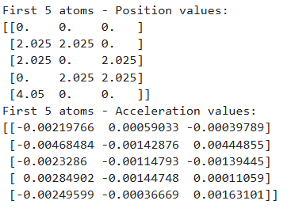
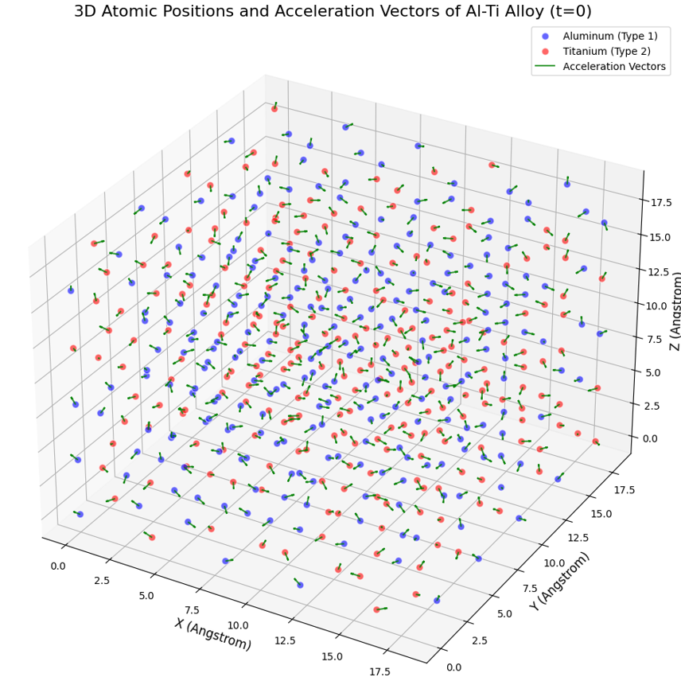

# Al-Ti Alloy Molecular Dynamics Simulation

This project performs a Molecular Dynamics (MD) simulation to calculate and visualize the initial atomic positions and acceleration vectors of an Aluminum-Titanium (Al-Ti) alloy. The simulation is powered by **LAMMPS** and analyzed using **Python**.

## 🚀 Features
- **Crystal Structure:** FCC lattice modeling with a lattice constant of 4.05 Å.
- **Interatomic Potential:** Modified Embedded Atom Method (MEAM) for accurate Al-Ti interactions.
- **Data Processing:** Automated calculation of acceleration matrices from force outputs ($a = F/m$).
- **Visualization:** 3D plotting of atomic species with superimposed force/acceleration vectors.

## 📁 File Structure
- `in.proje`: LAMMPS input script.
- `library.meam` & `TiAl.meam`: MEAM potential parameter files. (Obtained from this link:https://www.ctcms.nist.gov/potentials/entry/2025--Sharifi-H-Wick-C-D--Ti-Al/2025--Sharifi-H--Ti-Al--LAMMPS--ipr1.html)
- `lmp.exe`: LAMMPS executable engine.
- `output.txt`: Raw simulation data (positions and forces).
- `analysis.ipynb`: Jupyter Notebook for processing and visualization.

## 🛠️ Usage

1. **Run Simulation:**
   Open your terminal in the project directory and run:
   ```bash
   lmp.exe -in in.proje
   
**and you will get the output.txt file**

## 📊 Results





COMPUTATIONAL MODELING AND SIMULATION OF MATERIALS
Muhammed Eren Balıbey 2540091015 
